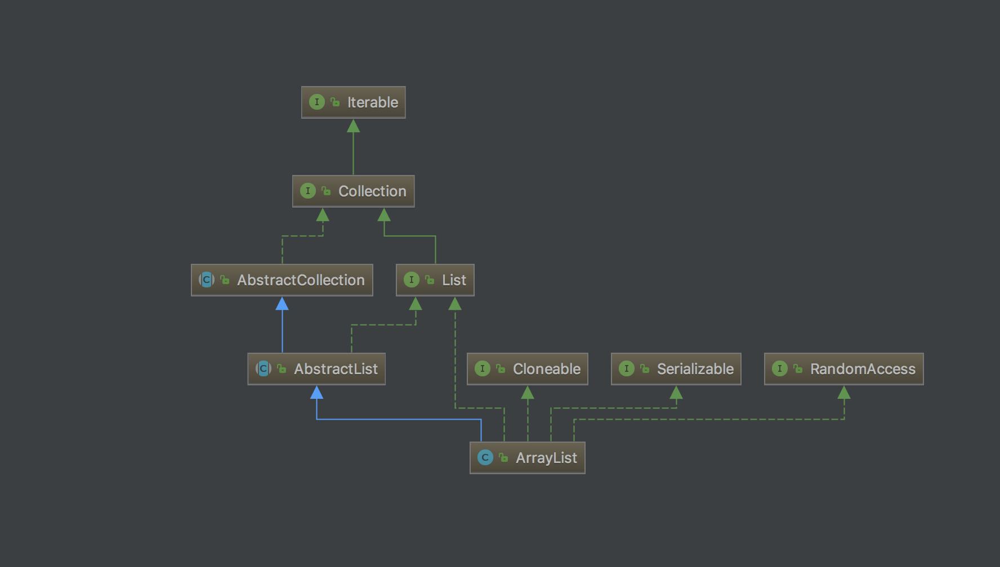
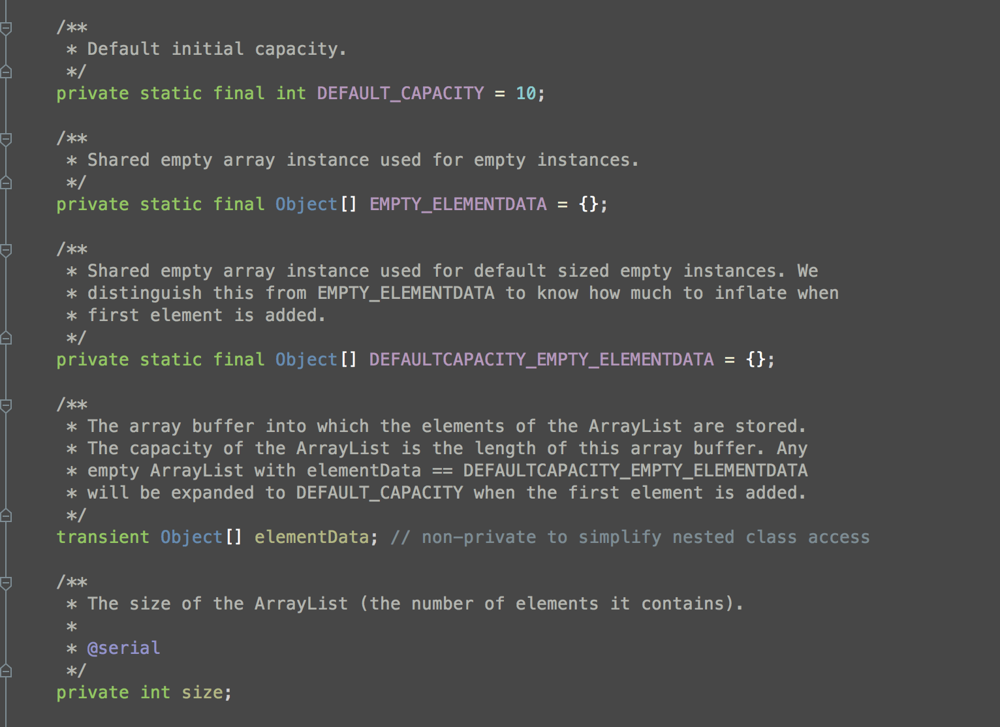

# ArrayList

## 数据结构

```ArrayList``` 的数据机构是数组，通过用动态数组的方式来存储数据。

## UML

首先我们来看一下 ```ArrayList``` 的UML图：
 
实现了```List``` ```RandomAccess``` ```Collection``` ```iterable``` ```Cloneable``` ```Serializable``` 等接口。
 
 ```RandomAccess``` 是一个标记接口，用于标明实现该接口的List支持快速随机访问，一般的列表访问算法在访问列表元素之前，都被建议先使用instanceof关键字检查一下列表是否是一个RandomAccess子类，然后再决定采用随机还是顺序方式访问列表中的元素，这样可以保证访问算法拥有最佳的性能。
 如果采用
 
 ```java
 for(int i=0, len=list.size(); i < n; i++)
 	list.get(i)
 ```
 的访问方式比采用
 
 ```java
 for(Iterator i=list.iterator(); i.hasNext();)
 	i.next();
 ```
 的访问方式要快的话，那么就应该实现该接口。
 
 ```clone```：它允许在堆中克隆出一块和原对象一样的对象，并将这个对象的地址赋予新的引用。 ```Java``` 中 一个类要实现 ```clone``` 功能 必须实现 ```Cloneable``` 接口，否则在调用 ```clone()``` 时会报 ```CloneNotSupportedException``` 异常。如果一个类重写了 ```Object``` 内定义的 ```clone()```方法 ，需要同时实现 ```Cloneable``` 接口（虽然这个接口内并没有定义 ```clone()``` 方法），否则会抛出异常，也就是说， ```Cloneable``` 接口只是个合法调用 ```clone()``` 的标识（marker-interface）。要注意的是 ```Object``` 类的 ```clone()```方法是一个 ```native``` 方法，一般来说 ```native``` 方法的效率都是远高于 ```java``` 中的非 ```native``` 方法，所以很多实现类覆写 ```clone()``` 方法的类调用 ```super.clone();``` 来进行实现，同时需要注意的是 ```clone()``` 在 ```Object``` 中是一个 ```protected``` 的方法，所以在覆写的时候需要将访问权限设置为 ```public``` 以方便其余的类来使用该方法。
 
 ```Serializable``` 也是一个标记接口，标识实现该接口的类可以序列化。对象的寿命通常随着生成该对象的程序的终止而终止，有时候需要把在内存中的各种对象的状态（也就是实例变量，不是方法）保存下来，并且可以在需要时再将对象恢复。虽然你可以用你自己的各种各样的方法来保存对象的状态，但是Java给你提供一种应该比你自己的好的保存对象状态的机制，那就是 ```序列化```。序列化的用途： 1.想把的内存中的对象状态保存到一个文件中或者数据库中时候。2.想把对象通过网络进行传播的时候。```serialVersionUID```： 当实现了 ```Serializable```的时候一般会显示生成该 ```long``` 类型的属性，该值作用于序列化和反序列化的时候。如果不显示声明给值，序列化的时候JVM会自动计算给值，但是一般提倡显示声明该属性，因为 1. 小幅性能提升，免除JVM运行时对这个值的计算。2. 避免 ```java.io.InvalidClassException```，不同的JVM对 ```serialVersionUID``` 的计算方法可能不一样，就算类的定义和序列化后的对象是一致的，也可能从JVM-A里序列化后的对象到达JVM-B后，JVM-B认为 ```Class Invalid```。 当对象反序列化的时候是根据这个 ```serialVersionUID``` 来取数据。
 

## 属性和重要方法
```ArrayList``` 中重要的属性有：```DEFAULT_CAPACITY``` ```EMPTY_ELEMENTDATA``` ```DEFAULTCAPACITY_EMPTY_ELEMENTDATA``` ```elementData``` ```size```


```DEFAULT_CAPACITY``` 默认数组大小。默认值为10，当你用无参的构造器 ```new ArrayList()``` 时，在 ```add``` 数据的时候会给一个默认的数组大小，取的就是该值。

```EMPTY_ELEMENTDATA``` ```DEFAULTCAPACITY_EMPTY_ELEMENTDATA``` 都是新构造的时候把数组初始化为空。

```elementData``` 存储数据的数组，注意它的修饰符里有 ```transient```。这是因为 ```ArrayList``` 是用的动态数组，动态扩容，数组中的数据不一定是都填充满的，这种情况下去序列化的时候会根据实际存储的内容大小去做，所以这里用 ```transient``` 修饰。

```size``` 数组中实际内容的大小。

