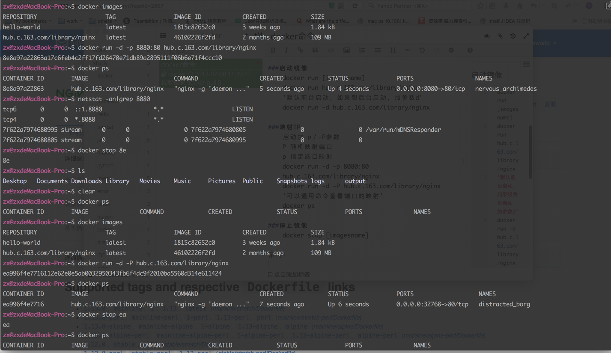
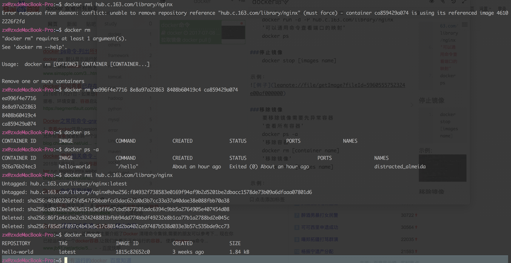

### 拉取镜像

```
    docker pull [images name:tag]
    imagesname 镜像名称
    tag版本号   
    例如:
    docker pull hub.c.163.com/library/nginx:latest
```

### 查看所有镜像

```
    docker images [images name]
```

### 启动镜像

```
    docker run [images name]
    docker run hub.c.163.com/library/nginx
    '默认前台启动，如果想后台启动，加参数d'
    docker run -d hub.c.163.com/library/nginx
```

### 映射IP

```
    启动加-p／-P参数
    P 随机映射端口
    p 指定端口映射
    docker run -d -p 8080:80 hub.c.163.com/library/nginx
    docker run -d -P hub.c.163.com/library/nginx
    '可以通用命令查看端口的映射'
    docker ps
```

### 停止镜像

```
    docker stop [images name]
```

示例：



### 移除镜像

```
    要移除镜像需要先异常容器
    '查看所有容器'
    docker ps -a
    '移除容器'
    docker rm [container name]
    '移除镜像'
    docker rmi [images name]
```

示例：


    
### 进入镜像容器

```
    '查看所有容器'
    docker ps -a
    '进入容器'
    docker exec -it [container name] 
    docker exec -it 1cfcfed667ff /bin/bash
```

### 将war放到容器中

```
    docker cp /Users/zx/Documents/jpress.war 1cfcfed667ff:/usr/local/tomcat/webapps
```

### 启动一个容器

```
	docker start <container name>
```
