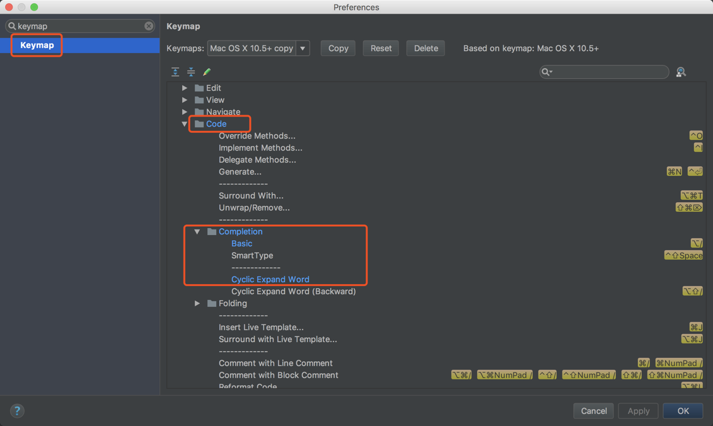

#### 快速打开类 -- com+o
#### 快速打开搜索所有类 -- com+option+o
#### 搜索文件 -- com+shift+o
#### 关闭窗口 -- com+w
#### 通过字符搜索 -- com+shift+f
#### 本文搜索 -- com+f
#### 快速生成getter/setter -- com+n
#### 移动选中代码 -- com+shift+上下
#### 快速显示类中方法/属性 -- com+f12
#### 显示方法参数 -- com+p
#### 选中文本出现的地方 -- com+option+f7
#### 查询方法被引用 -- option+f7
#### 查看类的继承结构 -- control+h
#### 查看方法的继承结构 --control+option+h
#### 优化导包 -- control+option+o
#### 快速生产单元测试类 -- com+shift+t
#### 格式化代码 -- com+option+l
#### 错误提示解决方案 -- option+回车
#### 代码提示设置
#### 选定代码被if while try等包裹 -- com+option+t
#### 修改代码重复提示路径

Settings —> Editor —> Inspections —> General —> Duplicated Code

