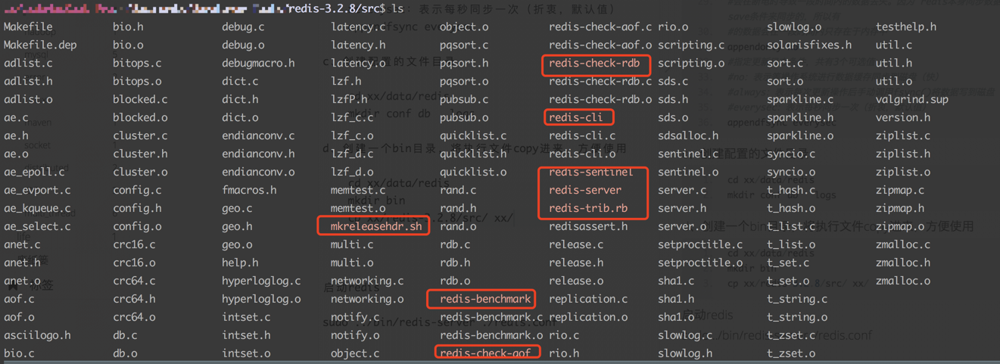
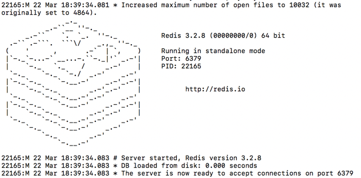
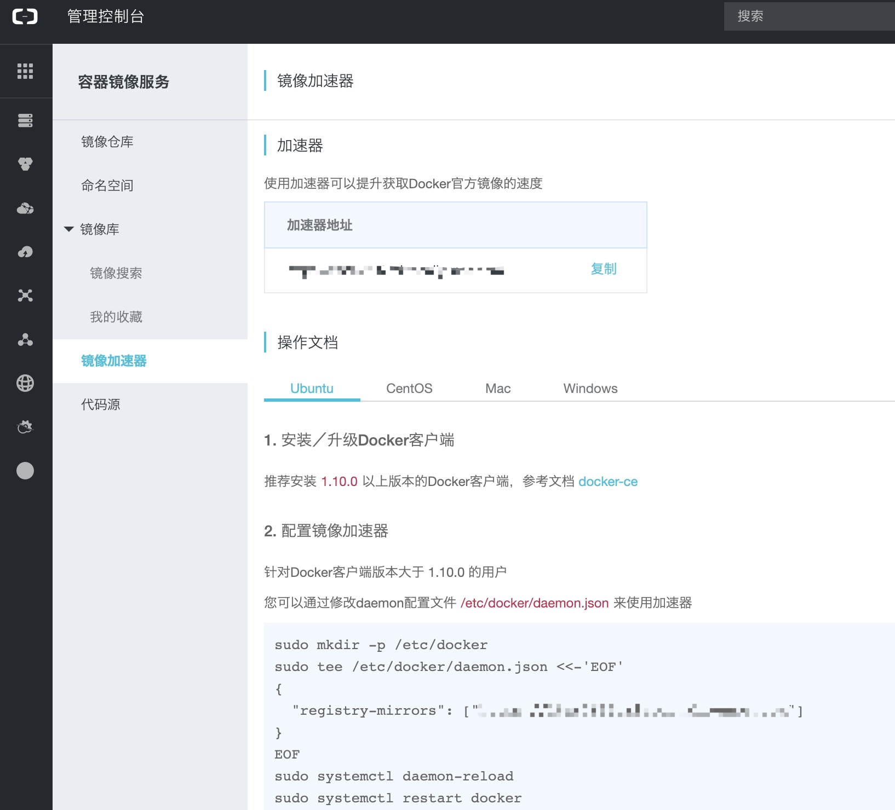

## Linux安装方式

#### 1、官网下载包

```
    https://redis.io/
```

#### 2、解析到安装目录

```
    sudo tar -zxf redis-3.2.8.tar.gz
```

#### 3、编译测试

```
    cd xx/redis-3.2.8
    sudo make test
```

#### 4、redis安装

```
    sudo make install
    
```

#### 5、自定义配置文件并启动

> 将redis中的默认配置文件copy一份到自定义目录

```
    cd xx/redis-3.2.8
    cp redis.conf  xx/data/redis/conf/
```

> 修改配置文件如下

```
    #修改为守护模式
    daemonize yes
    #设置进程锁文件
    pidfile xx/data/redis/redis.pid
    #端口
    port 6379
    #客户端超时时间
    timeout 300
    #日志级别
    loglevel debug
    #日志文件位置
    logfile xx/data/redis/logs/log-redis.log
    #设置数据库的数量，默认数据库为0，可以使用SELECT <dbid>命令在连接上指定数据库id
    databases 8
    ##指定在多长时间内，有多少次更新操作，就将数据同步到数据文件，可以多个条件配合
    #save <seconds> <changes>
    #Redis默认配置文件中提供了三个条件：
    save 900 1
    save 300 10
     save 60 10000
    #指定存储至本地数据库时是否压缩数据，默认为yes，Redis采用LZF压缩，如果为了节省CPU时间，
    #可以关闭该#选项，但会导致数据库文件变的巨大
    rdbcompression yes
    #指定本地数据库文件名
    dbfilename dump.rdb
    #指定本地数据库路径
    dir xx/data/redis/db/
    #指定是否在每次更新操作后进行日志记录，Redis在默认情况下是异步的把数据写入磁盘，如果不开启，可能
    #会在断电时导致一段时间内的数据丢失。因为 redis本身同步数据文件是按上面save条件来同步的，所以有
    #的数据会在一段时间内只存在于内存中
    appendonly no
    #指定更新日志条件，共有3个可选值：
    #no：表示等操作系统进行数据缓存同步到磁盘（快）
    #always：表示每次更新操作后手动调用fsync()将数据写到磁盘（慢，安全）
    #everysec：表示每秒同步一次（折衷，默认值）
    appendfsync everysec
```

> 创建配置的文件目录

```
    cd xx/data/redis
    mkdir conf db   logs
```

> 创建一个bin目录，将执行文件copy进来，方便使用

```    
    cd xx/data/redis
    mkdir bin
    执行文件如下图目录和文件
```



> 创建后的目录结构如图


> 启动redis

```   
    sudo ./xx/data/redis/bin/redis-server xx/data/redis/conf/redis.conf
```

##### <font color=red> 必须使用sudo给够权限，不然会报错的 </font>

> 到日志文件中查看启动日志

```
    cd xx/data/redis/logs
    tail -f log-redis.log
```



> 关闭redis
```
    redis-cli shutdown
```

---

## docker中安装

#### docker设置加速镜像地址

推荐使用阿里云加速
https://cr.console.aliyun.com/cn-hangzhou/mirrors
注册，登录后会有个自己的镜像地址，还有设置方式说明



#### 1、拉取镜像

```
	官方镜像
    docker pull redis
```

#### 2、解析到安装目录

```
    sudo tar -zxf redis-3.2.8.tar.gz
```
