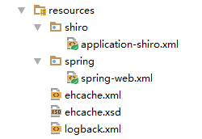
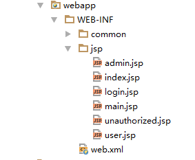

## shiro与spring结合实现登录验证
### 搭建maven项目
	通过命令创建项目
	mvn archetype:generate -DgroupId=com.test -DartifactId=demo -DarchetypeArtifactId=maven-archetype-webapp
	//  其余目录手动补齐
### 引入shiro依赖
```
<!-- Shiro依赖 -->
<dependency>
    <groupId>org.apache.shiro</groupId>
    <artifactId>shiro-core</artifactId>
    <version>1.2.3</version>
</dependency>
<dependency>
    <groupId>org.apache.shiro</groupId>
    <artifactId>shiro-web</artifactId>
    <version>1.2.3</version>
</dependency>
<dependency>
    <groupId>org.apache.shiro</groupId>
    <artifactId>shiro-ehcache</artifactId>
    <version>1.2.3</version>
</dependency>
<!-- shiro和spring集成的包 -->
<dependency>
    <groupId>org.apache.shiro</groupId>
    <artifactId>shiro-spring</artifactId>
    <version>1.2.3</version>
</dependency>
```
### 配置web.xml文件
```
<context-param>
    <param-name>contextConfigLocation</param-name>
    <param-value>
        classpath:shiro/application-shiro.xml,
        classpath:spring/spring-*.xml
    </param-value>
</context-param>
<listener>
    <listener-class>org.springframework.web.context.ContextLoaderListener</listener-class>
</listener>
<!-- shiro过滤器 -->
<filter>
    <filter-name>shiroFilter</filter-name>
    <filter-class>org.springframework.web.filter.DelegatingFilterProxy</filter-class>
    <init-param>
        <param-name>targetFilterLifecycle</param-name>
        <param-value>true</param-value>
    </init-param>
</filter>
<filter-mapping>
    <filter-name>shiroFilter</filter-name>
    <url-pattern>/*</url-pattern>
</filter-mapping>
<!-- springWeb -->
<servlet>
    <servlet-name>springDispather</servlet-name>
    <servlet-class>org.springframework.web.servlet.DispatcherServlet</servlet-class>
    <init-param>
        <param-name>contextConfigLocation</param-name>
        <param-value>classpath:spring/spring-*.xml</param-value>
    </init-param>
</servlet>
<servlet-mapping>
    <servlet-name>springDispather</servlet-name>
    <url-pattern>/</url-pattern>
</servlet-mapping>
```
### 书写springMVC配置文件
```
<?xml version="1.0" encoding="UTF-8"?>
<beans xmlns="http://www.springframework.org/schema/beans"
   xmlns:mvc="http://www.springframework.org/schema/mvc"
   xmlns:xsi="http://www.w3.org/2001/XMLSchema-instance"
   xmlns:context="http://www.springframework.org/schema/context"
   xsi:schemaLocation="http://www.springframework.org/schema/beans
    http://www.springframework.org/schema/beans/spring-beans.xsd
    http://www.springframework.org/schema/mvc
    http://www.springframework.org/schema/mvc/spring-mvc.xsd
    http://www.springframework.org/schema/context
    http://www.springframework.org/schema/context/spring-context.xsd">
    <!-- 开启mvc注解 -->
    <mvc:annotation-driven/>
    <!-- 开启静态配置 -->
    <mvc:default-servlet-handler/>
    <!-- 配置jsp -->
    <bean class="org.springframework.web.servlet.view.InternalResourceViewResolver">
        <property name="viewClass" value="org.springframework.web.servlet.view.JstlView"/>
        <property name="prefix" value="/WEB-INF/jsp/"/>
        <property name="suffix" value=".jsp"/>
    </bean>
    <!-- 扫描web包 -->
    <context:component-scan base-package="com.test.web"/>
</beans>
```
### 书写shiro配置文件
```
<?xml version="1.0" encoding="UTF-8"?>
<beans xmlns="http://www.springframework.org/schema/beans"
   xmlns:xsi="http://www.w3.org/2001/XMLSchema-instance"
   xmlns:util="http://www.springframework.org/schema/util"
   xsi:schemaLocation="http://www.springframework.org/schema/beans
   http://www.springframework.org/schema/beans/spring-beans-3.0.xsd
   http://www.springframework.org/schema/util
   http://www.springframework.org/schema/util/spring-util.xsd">
<!-- 配置shiro缓存 -->
<bean id="cacheManager" class="org.apache.shiro.cache.ehcache.EhCacheManager">
    <!-- shiro默认使用ehcache缓存,所以这里还需要配置ehcahe -->    
    <property name="cacheManagerConfigFile" value="classpath:ehcache.xml"/>
</bean>
<!-- 自定义认证和授权realm(必须) -->
<bean id="myRealm" class="com.test.shiro.realm.MyRealm"></bean>
<bean id="securityManager" class="org.apache.shiro.web.mgt.DefaultWebSecurityManager">
    <property name="cacheManager" ref="cacheManager"/>
    <property name="realm" ref="myRealm"/>
</bean>
<!-- 配置Bean后置处理器：会自动调用spring整合后的生命周期方法 -->
<bean id="lifecycleBeanPostProcessor" class="org.apache.shiro.spring.LifecycleBeanPostProcessor"/>
<!-- 使shiro注解起作用，验证粒度可以定义到方法级，这个配置如果需要，请书写到springMVC的IOC容器中，写在这里是不起作用的 -->
<!-- <bean class="org.springframework.aop.framework.autoproxy.DefaultAdvisorAutoProxyCreator"
      depends-on="lifecycleBeanPostProcessor"/>
<bean class="org.apache.shiro.spring.security.interceptor.AuthorizationAttributeSourceAdvisor"> 
    <property name="securityManager" ref="securityManager"/>
</bean> -->
<!-- 配置shiroFileter -->
<bean id="shiroFilter" class="org.apache.shiro.spring.web.ShiroFilterFactoryBean">
    <property name="securityManager" ref="securityManager"/>
    <!-- 登录的访问 -->
    <property name="loginUrl" value="/login"/>
    <!-- 登录成功后的访问 -->
    <property name="successUrl" value="/main/index"/>
    <!-- 没有权限的访问 -->
    <property name="unauthorizedUrl" value="/unauthorized"/>
    <property name="filterChainDefinitions">
        <!-- 配置访问路径是否需要验证以及需要哪些验证 -->
        <value>
            / = anon
            /loginPage = anon
            /user = roles[user]
            /admin = roles[admin]
            # allow WebStart to pull the jars for the swing app:
            /*.jar = anon
            # everything else requires authentication:
            #/** = authc
            /** = authc
        </value>
    </property>
</bean>
</beans>
```
### 书写ehcache配置文件 (这个依赖在shiro的引用时已经引用了，只需要配置)
```
<?xml version="1.0" encoding="utf-8"?>
<ehcache xmlns:xsi="http://www.w3.org/2001/XMLSchema-instance"
         xsi:noNamespaceSchemaLocation="ehcache.xsd" updateCheck="false">
    <diskStore path="java.io.tmpdir"/>
    <defaultCache maxElementsInMemory="10000" eternal="false" timeToIdleSeconds="30" timeToLiveSeconds="30"
                  overflowToDisk="false"/>
    <!--           
    配置自定义缓存          
    maxElementsInMemory：缓存中允许创建的最大对象数          
    eternal：缓存中对象是否为永久的，如果是，超时设置将被忽略，对象从不过期。          
    timeToIdleSeconds：缓存数据的钝化时间，也就是在一个元素消亡之前，                      
                    两次访问时间的最大时间间隔值，这只能在元素不是永久驻留时有效，                      
                    如果该值是 0 就意味着元素可以停顿无穷长的时间。          
    timeToLiveSeconds：缓存数据的生存时间，也就是一个元素从构建到消亡的最大时间间隔值，
    这只能在元素不是永久驻留时有效，如果该值是0就意味着元素可以停顿无穷长的时间。
    overflowToDisk：内存不足时，是否启用磁盘缓存。          
    memoryStoreEvictionPolicy：缓存满了之后的淘汰算法。      
    -->
    <cache name="testCache"
           maxElementsInMemory="10000"
           eternal="true"
           overflowToDisk="false"
           timeToIdleSeconds="0"
           timeToLiveSeconds="600"
           memoryStoreEvictionPolicy="LFU"/>
</ehcache>
```

有时候在配置该文件的时候，会出现找不到ehcache.xsd的情况，需要这个文件，就需要添加一个该文件，内容什么的，可以搜索下

最后配置文件目录是这样的



### 实现自定义认证和授权realm 
目录是这个com.test.shiro.realm.MyRealm，配置文件中写了 
实现：

```
package com.test.shiro.realm;
import org.apache.shiro.authc.*;
import org.apache.shiro.authz.AuthorizationInfo;
import org.apache.shiro.authz.SimpleAuthorizationInfo;
import org.apache.shiro.realm.AuthorizingRealm;
import org.apache.shiro.subject.PrincipalCollection;
public class MyRealm extends AuthorizingRealm {
    /**
     * 授权方法
     *
     * @param principalCollection
     * @return
     */
    @Override
    protected AuthorizationInfo doGetAuthorizationInfo(PrincipalCollection principalCollection) {
        SimpleAuthorizationInfo simpleAuthorizationInfo = new SimpleAuthorizationInfo();
        Object principal = principalCollection.getPrimaryPrincipal(); // 看做用户名
        if ("admin".equals(principal)) {
            simpleAuthorizationInfo.addRole("admin");
        } else {
            simpleAuthorizationInfo.addRole("user");
        }
        return simpleAuthorizationInfo;
    }
    /**
     * 认证方法
     *
     * @param authenticationToken
     * @return
     * @throws AuthenticationException
     */
    @Override
    protected AuthenticationInfo doGetAuthenticationInfo(AuthenticationToken authenticationToken) throws AuthenticationException {
        System.out.println(authenticationToken.getPrincipal()); // 可以看做用户名
        System.out.println(authenticationToken.getCredentials()); // 可以看做密码
        Object principal = authenticationToken.getPrincipal(); // 可以当做是页面传递过来的用户名
        String fredentials = "123456"; // 数据库查询出来的密码
        String realmName = getName(); // 取当前realm的name
        /**
         * 这里就可以用用户名到数据去查询，是否存在，是否已经被锁定什么的
         * 然后抛出相关的异常，交给controller去捕获并提示
         * 如：UnknownAccountException， LockedAccountException
         */
        //  密码都交给shiro对比    
        SimpleAuthenticationInfo simpleAuthenticationInfo = new SimpleAuthenticationInfo(principal, fredentials, realmName);
        return simpleAuthenticationInfo;
    }
}
```

### 实现登录controller

```
package com.test.web;
import org.apache.shiro.SecurityUtils;
import org.apache.shiro.authc.*;
import org.apache.shiro.subject.Subject;
import org.apache.shiro.web.filter.authc.FormAuthenticationFilter;
import org.slf4j.Logger;
import org.slf4j.LoggerFactory;
import org.springframework.stereotype.Controller;
import org.springframework.ui.Model;
import org.springframework.web.bind.annotation.RequestMapping;
import org.springframework.web.bind.annotation.RequestParam;
import javax.servlet.ServletRequest;
@Controller
public class LoginController {
    private final Logger logger = LoggerFactory.getLogger(getClass());
    /**
     * 默认主页
     *
     * @return
     */
    @RequestMapping("/")
    public String index() {
        return "index";
    }
    /**
     * 进入登录页面
     *
     * @return
     */
    @RequestMapping("/loginPage")
    public String goLoginPage() {
        return "login";
    }
    /**
     * 登录
     *
     * @return
     */
    @RequestMapping("/login")
    public String login(@RequestParam("username") String username,
                        @RequestParam("password") String password,
                        Model model, ServletRequest servletRequest) {
        Subject subject = SecurityUtils.getSubject();
        UsernamePasswordToken token = new UsernamePasswordToken(username, password);
        try {
            subject.login(token); // 通过捕捉不同的异常来实现不同登录提醒
        } catch (UnknownAccountException uae) {
            logger.info("There is no user with username of " + token.getPrincipal());
            model.addAttribute("errorMsg", "没有当前用户名: " + token.getPrincipal());
            return "login";
        } catch (IncorrectCredentialsException ice) {
            logger.info("用户名: " + token.getPrincipal() + " 的密码错误");
            model.addAttribute("errorMsg", "Password for account " + token.getPrincipal() + " was incorrect!");
            return "login";
        } catch (LockedAccountException lae) {
            logger.info("The account for username " + token.getPrincipal() + " is locked.  " +
                    "Please contact your administrator to unlock it.");
            model.addAttribute("errorMsg", "用户名: " + token.getPrincipal() + "被锁定");
            return "login";
        }
        // ... catch more exceptions here (maybe custom ones specific to your application?
        catch (AuthenticationException ae) {
            logger.info("other error." + ae.getMessage());
        }
        model.addAttribute("username", username);
        return "main";
    }
    /**
     * 登录认证成功
     * @return
     */
    @RequestMapping("/main/index")
    public String main(){
        return "main";
    }
    /**
     * 登录认证失败
     *
     * @return
     */
    @RequestMapping("/unauthorized")
    public String unauthorized() {
        return "unauthorized";
    }
    /**
     * user用户可以访问的页面
     *
     * @return
     */
    @RequestMapping("/user")
    public String user() {
        return "user";
    }
    /**
     * admin用户可以访问的页面
     *
     * @return
     */
    @RequestMapping("/admin")
    public String admin() {
        return "admin";
    }
}
```

### 书写页面 



简单的登录验证就做完了

### 添加验证码
* 添加验证码生成，使用 <font color="red">kaptcha</font> 实现
* 需要扩展shiro默认的filter过滤验证 ： FormAuthenticationFilter
* 需要扩展token，我选择的是扩展 ： UsernamePasswordToken
* shiro配置文件中，启用filter配置
* 可选：改写realm
* 改写controller

> 引用kaptcha依赖

```
<!-- 验证码jar -->
<dependency>
    <groupId>com.google.code</groupId>
    <artifactId>kaptcha</artifactId>
    <version>2.3.2</version>
</dependency>
```

<font color="#4F94CD">将jar包导入本地maven库: mvn install:install-file -DgroupId=com.google.code -DartifactId=kaptcha -Dversion=2.3.2 -Dfile=D:\kaptcha-2.3.jar -Dpackaging=jar -DgeneratePom=true</font>

> 配置web.xml文件

```
<!-- 验证码 -->
<servlet>
    <servlet-name>captcha</servlet-name>
    <servlet-class>com.google.code.kaptcha.servlet.KaptchaServlet</servlet-class>
</servlet>
<servlet-mapping>
    <servlet-name>captcha</servlet-name>
    <url-pattern>/captcha.jsp</url-pattern>
</servlet-mapping>
```

> 实现token扩展

```
package com.test.shiro.realm;
import org.apache.shiro.authc.UsernamePasswordToken;
public class MyUsernamePasswordToken extends UsernamePasswordToken {
    private String captcha;
    public MyUsernamePasswordToken(String username, String password, boolean rememberMe, String host, String captcha) {
        super(username, password, rememberMe, host);
        this.captcha = captcha;
    }
    public String getCaptcha() {
        return captcha;
    }
    public void setCaptcha(String captcha) {
        this.captcha = captcha;
    }
}
```

> 实现filter扩展

```
package com.test.shiro.realm;
import com.google.code.kaptcha.Constants;
import com.test.shiro.realm.exception.IncorrectCaptchaException;
import org.apache.shiro.authc.AuthenticationException;
import org.apache.shiro.authc.IncorrectCredentialsException;
import org.apache.shiro.authc.LockedAccountException;
import org.apache.shiro.authc.UnknownAccountException;
import org.apache.shiro.subject.Subject;
import org.apache.shiro.web.filter.authc.FormAuthenticationFilter;
import org.apache.shiro.web.util.WebUtils;
import javax.servlet.ServletRequest;
import javax.servlet.ServletResponse;
import javax.servlet.http.HttpServletRequest;
public class MyFormAuthenticationFilter extends FormAuthenticationFilter {
    public static final String CAPTCHA_PARAM = "captcha";
    private String captchaParam = CAPTCHA_PARAM;
    @Override
    protected boolean executeLogin(ServletRequest request, ServletResponse response) throws Exception {
        MyUsernamePasswordToken token = this.createToken(request, response);
        if (token == null) {
            String e1 = "createToken method implementation returned null. A valid non-null AuthenticationToken must be created in order to execute a login attempt.";
            throw new IllegalStateException(e1);
        } else {
            try {
                // 添加一个验证码验证
                doCaptchaValidate(request, token);
                Subject e = getSubject(request, response);
                e.login(token); // 调用login方法时，会调用自定义realm中的doGetAuthenticationInfo方法
                // 保存用户
                HttpServletRequest httpRequest = (HttpServletRequest) request;
                httpRequest.getSession().setAttribute("username", token.getUsername());
                return this.onLoginSuccess(token, e, request, response);
            } catch (UnknownAccountException uae) {
                return this.onLoginFailure(token, new AuthenticationException("没有该用户名"), request, response);
            } catch (IncorrectCredentialsException ice) {
                return this.onLoginFailure(token, new AuthenticationException("密码错误"), request, response);
            } catch (LockedAccountException lae) {
                return this.onLoginFailure(token, new AuthenticationException("该用户已被锁定"), request, response);
            } catch (AuthenticationException var5) {
                return this.onLoginFailure(token, var5, request, response);
            }
        }
    }
    // 覆写了添加错误属性方法，将异常的信息保存
    @Override
    protected void setFailureAttribute(ServletRequest request, AuthenticationException ae) {
        request.setAttribute(this.getFailureKeyAttribute(), ae.getMessage());
    }
    /**
     * 验证码验证
     *
     * @param request
     * @param token
     */
    protected void doCaptchaValidate(ServletRequest request, MyUsernamePasswordToken token) {
        HttpServletRequest httpRequest = (HttpServletRequest) request;
        String sessionCaptcha = (String) httpRequest.getSession().getAttribute(Constants.KAPTCHA_SESSION_KEY);
        if (sessionCaptcha != null && !sessionCaptcha.equalsIgnoreCase(token.getCaptcha())) {
            throw new IncorrectCaptchaException("验证码错误"); // 这里是自定义了一个异常抛出验证码错误，异常继承AuthenticationException
        }
    }
    /**
     * 覆写创建token方法，创建自己的token
     *
     * @param request
     * @param response
     * @return
     */
    @Override
    protected MyUsernamePasswordToken createToken(ServletRequest request, ServletResponse response) {
        String username = this.getUsername(request);
        String password = this.getPassword(request);
        String captcha = this.getCaptcha(request);
        boolean rememberMe = this.isRememberMe(request);
        String host = this.getHost(request);
        MyUsernamePasswordToken myUsernamePasswordToken = new MyUsernamePasswordToken(username, password, rememberMe, host, captcha);
        return myUsernamePasswordToken;
    }
    protected String getCaptcha(ServletRequest request) {
        return WebUtils.getCleanParam(request, this.getCaptchaParam());
    }
    public String getCaptchaParam() {
        return captchaParam;
    }
    public void setCaptchaParam(String captchaParam) {
        this.captchaParam = captchaParam;
    }
}
```

> 改写MyRealm

```
package com.test.shiro.realm;
import org.apache.shiro.authc.*;
import org.apache.shiro.authz.AuthorizationInfo;
import org.apache.shiro.authz.SimpleAuthorizationInfo;
import org.apache.shiro.realm.AuthorizingRealm;
import org.apache.shiro.subject.PrincipalCollection;
public class MyRealm extends AuthorizingRealm {
    /**
     * 授权方法
     *
     * @param principalCollection
     * @return
     */
    @Override
    protected AuthorizationInfo doGetAuthorizationInfo(PrincipalCollection principalCollection) {
        SimpleAuthorizationInfo simpleAuthorizationInfo = new SimpleAuthorizationInfo();
        Object principal = principalCollection.getPrimaryPrincipal(); // 看做用户名
        if ("admin".equals(principal)) {
            simpleAuthorizationInfo.addRole("admin");
        } else {
            simpleAuthorizationInfo.addRole("user");
        }
        return simpleAuthorizationInfo;
    }
    /**
     * 认证方法
     *
     * @param authenticationToken
     * @return
     * @throws AuthenticationException
     */
    @Override
    protected AuthenticationInfo doGetAuthenticationInfo(AuthenticationToken authenticationToken) throws AuthenticationException {
        MyUsernamePasswordToken myToken = (MyUsernamePasswordToken) authenticationToken;
        String username = myToken.getUsername();
        String password = "123456"; // 根据用户名到数据库查询出来的密码
        String realmName = getName(); // 取当前realm的name
        // 这里就可以用用户名到数据去查询，是否存在，是否已经被锁定什么的，也可以将这些判断都写在MyFormAuthenticationFilter中
        // 这里就单纯的创建一个SimpleAuthenticationInfo也是可以的
        // 注意：不要把密码给传递错误了，这里的密码得是数据库查询出来的
        if ("123".equals(username)) { // 举个用户名不存在的例子
            throw new UnknownAccountException();
            // 这个异常会被MyFormAuthenticationFilter中executeLogin方法中的调用捕获
        }
        SimpleAuthenticationInfo simpleAuthenticationInfo = new SimpleAuthenticationInfo(username, password, realmName);
        return simpleAuthenticationInfo;
    }
}
```

> 改写controller

```
 /**
 * 登录
 *
 * @return
 */
@RequestMapping("/login")
public String login(@RequestParam("username") String username,
                    @RequestParam("password") String password,
                    HttpSession session, ServletRequest servletRequest) {
    Subject subject = SecurityUtils.getSubject();
    if (subject.isAuthenticated()) {
        return "redirect:/main/index";
    } else {
        session.setAttribute("errorMsg", servletRequest.getAttribute(FormAuthenticationFilter.DEFAULT_ERROR_KEY_ATTRIBUTE_NAME));
        return "redirect:/loginPage";
    }
}
```

> 改写shiro配置文件

```
 <!-- 自定义验证filter -->
    <bean id="myAuthenFilter" class="com.test.shiro.realm.MyFormAuthenticationFilter"></bean>
    <!-- 配置shiroFileter -->
    <bean id="shiroFilter" class="org.apache.shiro.spring.web.ShiroFilterFactoryBean">
        <property name="securityManager" ref="securityManager"/>
        <property name="loginUrl" value="/login"/>
        <property name="successUrl" value="/main/index"/>
        <property name="unauthorizedUrl" value="/unauthorized"/>
        <!-- 将自定义filter注入 -->
         <property name="filters">
            <util:map>
                <entry key="authc" value-ref="myAuthenFilter"/>
            </util:map>
        </property>
        <property name="filterChainDefinitions">
            <value>
                / = anon
                /loginPage = anon
                <!-- 这里是配置验证码不需要验证 -->
                /captcha.jsp = anon
                /user = roles[user]
                /admin = roles[admin]
                # allow WebStart to pull the jars for the swing app:
                /*.jar = anon
                # everything else requires authentication:
                #/** = authc
                /** = authc
            </value>
        </property>
    </bean>
</beans>
```

<font color="red"> 注意点：shiro中配置的路径得跟controller中的路径一致 </font>

```
<bean id="shiroFilter" class="org.apache.shiro.spring.web.ShiroFilterFactoryBean">
    <property name="securityManager" ref="securityManager"/>
    <property name="loginUrl" value="/login"/>
    <property name="successUrl" value="/main/index"/>
    <property name="unauthorizedUrl" value="/unauthorized"/>
    <!-- 这里的路径跟controller中的路径要一样 -->
 ```