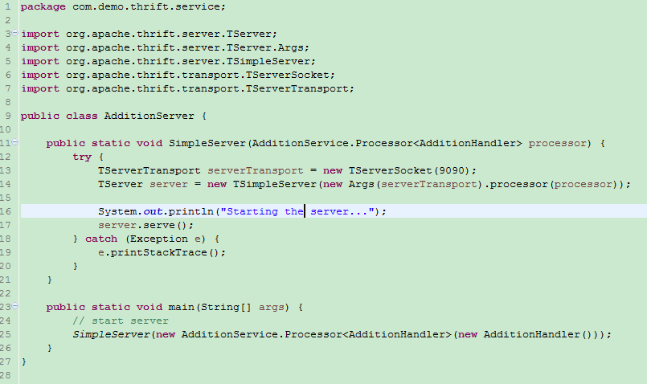

## apache thrift 简单使用

### 下载thrift包

```
https://mirrors.tuna.tsinghua.edu.cn/apache/thrift/0.9.3/thrift-0.9.3.tar.gz
```

### Build and Install the Apache Thrift compiler(下载编译包)

```
在Windows环境下直接下载https://mirrors.tuna.tsinghua.edu.cn/apache/thrift/0.9.3/thrift-0.9.3.exe进行编译
```

### 编写.thrift文件

```
    这里参考官方的教程快速开始
    例如：
    namespace java com.demo.thrift.service
    
    typedef i32 int
    
    service AdditionService{
        int add(1:int a, 2:int b),
        string test(1:string str)
    }  
```

### 编译.thrift文件
> 解压thrift包到本地目录


> 将编译器thrift-0.9.3.exe和.thrift文件copy到本地目录E:\thrift-0.9.3\tutorial


> Windows编译：win+R 打开cmd，进入本地目录thrift-->tutorial下执行编译


    
> 在tutorial-->gen-java中就会看到编译后的java文件目录跟.thrift文件的namespace[com.demo.thrift.service]相同


    
> 将文件copy到你的项目中，注意文件的路径


    
> 项目中需要依赖thrift

```
    <dependency>
		<groupId>org.apache.thrift</groupId>
		<artifactId>libthrift</artifactId>
		<version>0.9.3</version>
	</dependency>
```
	
### 书写service handler
> 实现编译后的java文件AdditionService中的接口


### 写一个简单的server



### 写个客户端


### 启动server


### 客户端调用


## thrift spring 整合
